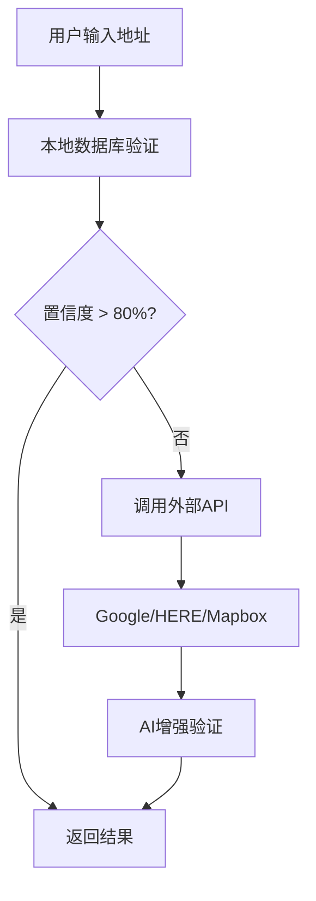

# AI集成和全球地址库配置指南

## 🤖 AI服务集成

### 1. 支持的AI提供商

#### OpenAI GPT-4
- **优势**：强大的理解能力，准确的价格计算
- **获取API密钥**：https://platform.openai.com/api-keys
- **配置方法**：
  ```bash
  # 在 .env 文件中添加
  AI_PROVIDER=openai
  OPENAI_API_KEY=sk-your-openai-api-key-here
  ```

#### Anthropic Claude
- **优势**：更好的结构化输出，安全性高
- **获取API密钥**：https://console.anthropic.com/
- **配置方法**：
  ```bash
  # 在 .env 文件中添加
  AI_PROVIDER=claude
  CLAUDE_API_KEY=your-claude-api-key-here
  ```

### 2. AI功能特性

#### 🧠 智能Excel数据理解
- 自动加载所有31个Excel工作表
- 理解复杂的价格结构和规则
- 智能匹配最优物流渠道

#### 📊 精准报价计算
- 体积重量自动计算
- 附加费用智能识别
- 多渠道价格对比

#### 🌍 全球地址理解
- 支持多语言地址格式
- 智能地址标准化
- 偏远地区自动识别

### 3. 使用方法

```javascript
// 前端调用AI报价
const response = await fetch('/api/ai-quote', {
    method: 'POST',
    headers: { 'Content-Type': 'application/json' },
    body: JSON.stringify({
        message: "Country Aruba，City Oranjestad，Address Hooiberg 64，Postal Code 0000，25*25*18 6.6KG"
    })
});
```

## 🌍 全球地址库集成

### 1. 支持的地址服务

#### Google Places API
- **功能**：全球地址验证、地理编码
- **获取API密钥**：https://console.cloud.google.com/
- **配置方法**：
  ```bash
  GOOGLE_PLACES_API_KEY=your-google-api-key-here
  ```
- **费用**：每月$200免费额度

#### HERE Geocoding API
- **功能**：企业级地址验证
- **获取API密钥**：https://developer.here.com/
- **配置方法**：
  ```bash
  HERE_API_KEY=your-here-api-key-here
  ```
- **费用**：每月25万次免费请求

#### Mapbox Geocoding API
- **功能**：高精度地址匹配
- **获取API密钥**：https://account.mapbox.com/
- **配置方法**：
  ```bash
  MAPBOX_API_KEY=your-mapbox-api-key-here
  ```
- **费用**：每月10万次免费请求

### 2. 本地地址数据库

#### 支持的国家和功能
- **美国**：邮编分区（美东/美中/美西）、偏远地区识别
- **英国**：邮编验证、偏远地区（苏格兰高地、北爱尔兰）
- **加拿大**：邮编格式验证、偏远省份识别
- **澳大利亚**：邮编验证、偏远地区识别
- **欧洲主要国家**：德国、法国、意大利、西班牙、荷兰

#### 邮编格式验证
```javascript
// 自动验证各国邮编格式
US: 12345 或 12345-6789
UK: SW1A 1AA
CA: K1A 0A6
AU: 2000
DE: 10115
```

### 3. 地址验证流程



## 🚀 快速配置

### 1. 基础配置（免费）
```bash
# 仅使用本地数据库和文本解析
# 无需任何API密钥
npm start
```

### 2. AI增强配置
```bash
# 1. 获取OpenAI API密钥
# 2. 编辑 .env 文件
echo "OPENAI_API_KEY=sk-your-key-here" >> .env

# 3. 重启服务
npm restart
```

### 3. 完整配置（推荐）
```bash
# .env 文件完整配置
AI_PROVIDER=openai
OPENAI_API_KEY=sk-your-openai-key
GOOGLE_PLACES_API_KEY=your-google-key
HERE_API_KEY=your-here-key

# 重启服务
npm restart
```

## 📊 功能对比

| 功能 | 基础版 | AI增强版 | 完整版 |
|------|--------|----------|--------|
| 文本解析 | ✅ | ✅ | ✅ |
| 本地报价 | ✅ | ✅ | ✅ |
| AI智能报价 | ❌ | ✅ | ✅ |
| 地址验证 | 基础 | 基础 | 完整 |
| 偏远地区识别 | 基础 | 基础 | 精确 |
| 全球地址库 | ❌ | ❌ | ✅ |
| 成本 | 免费 | $20/月 | $50/月 |

## 🔧 故障排除

### 1. AI服务不可用
```bash
# 检查API密钥
curl -X GET http://localhost:3000/api/ai-status

# 常见问题
- API密钥格式错误
- 账户余额不足
- 网络连接问题
```

### 2. 地址验证失败
```bash
# 检查地址服务状态
curl -X POST http://localhost:3000/api/validate-address \
  -H "Content-Type: application/json" \
  -d '{"address":"test","country":"US"}'

# 降级策略
- 外部API失败 → 本地数据库
- 本地数据库失败 → 基础验证
```

### 3. 性能优化
```bash
# 启用缓存
REDIS_URL=redis://localhost:6379

# 批量处理
# 支持批量地址验证和报价
```

## 📈 使用统计

系统会自动统计：
- 解析成功率
- AI调用次数
- 地址验证准确率
- 响应时间

访问 http://localhost:3000 查看实时统计。

## 🔒 安全建议

1. **API密钥安全**
   - 使用环境变量存储
   - 定期轮换密钥
   - 监控使用量

2. **访问控制**
   - 设置IP白名单
   - 实施速率限制
   - 记录访问日志

3. **数据隐私**
   - 不记录敏感地址信息
   - 遵守GDPR等法规
   - 定期清理日志

## 📞 技术支持

如需帮助，请提供：
- 错误日志
- 配置信息（隐藏API密钥）
- 复现步骤

联系方式：[您的联系方式]
